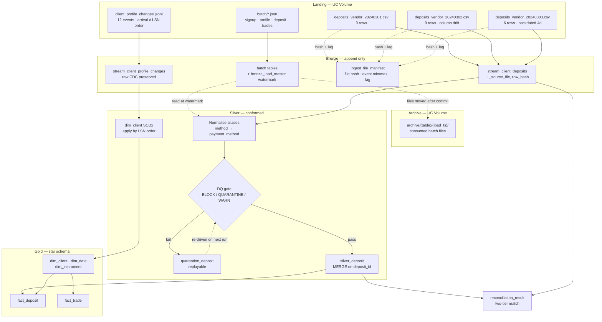

# Part 1 — Pipeline Design & Reconciliation

Platform: **Databricks on Unity Catalog**, Delta Lake, Auto Loader, Lakeflow Jobs.
Everything below is implemented in `code/databricks/` and proven locally in
`code/prototype/run_pipeline.py`, which runs end-to-end on the eight files in `data/`.

Every number quoted in this document is emitted by that prototype. Nothing is asserted
without a corresponding line of output.

---

## 1a.1 Architecture overview

### Layers

| Layer | Unity Catalog location | Responsibility | Mutability |
|---|---|---|---|
| **Landing** | `/Volumes/workspace/deriv_assement/data/batch/…`, `…/data/stream/…` | Raw vendor CSV, batch JSON and CDC JSONL land untouched. Never edited. Batch files are drained to the archive once captured; streaming files stay put under Auto Loader's checkpoint. | Immutable in content |
| **Archive** | `/Volumes/workspace/deriv_assement/data/archive/{table}/{yyyyMMddHHmmss}/` | Batch files moved here after a successful Bronze write, in a folder stamped with the load's `delta_created_ts`. Replay source of record. | Write-once |
| **Bronze** | `workspace.deriv_assement_bronze.*` | Append-only typed-as-string capture + lineage columns (`_source_file`, `delta_created_ts`, `row_hash`). No business rules. | Append-only |
| **Silver** | `workspace.deriv_assement_silver.*` | Schema-drift normalisation, typing, DQ gate, deduplication, idempotent `MERGE` on the business key. CDC applied here into SCD2. | Merge target |
| **Gold** | `workspace.deriv_assement_gold.*` | Kimball star: conformed dimensions + fact tables at declared grain. | Rebuildable |
| **Control** | `workspace.deriv_assement_bronze.bronze_load_master` / `bronze_load_history` / `streaming_load_history`, `ingest_file_manifest`, `cdc_apply_log`, `dq_result`, `quarantine_deposit`, `reconciliation_result` | Batch watermark + per-attempt batch history, per-micro-batch streaming history, file manifest, CDC watermark, DQ evidence, recon breaks. | Mixed |

The Bronze layer and its control tables already exist in
`code/databricks/01_bronze_batch_json.py` and `02_bronze_streaming_autoloader.py`.
This document extends them forward.

### Source-to-target flow



### What happens at each hop

**Vendor CSV path.** Auto Loader discovers new files incrementally and writes them to
Bronze with `_metadata.file_path` lineage. Silver then maps declared column aliases,
casts types, evaluates the DQ rule set, deduplicates on `deposit_id`, and `MERGE`s
survivors into `silver_deposit`.

**CDC path.** The JSONL lands in Bronze verbatim — Bronze deliberately does **not**
interpret the operation, because an un-replayable Bronze layer is a dead end during
incident recovery. Silver sorts the batch by `lsn`, applies each event against
`dim_client`, and records the outcome in `cdc_apply_log`.

**Batch JSON path.** `spark.read.json` captures each landing folder into its Bronze table,
then `bronze_load_master.latest_loaded_ts` is advanced and the consumed files are moved to
the archive. Silver and Gold read these tables at that watermark rather than in full, so a
re-run of the Bronze notebook cannot double-count. Mechanism (5) below covers the failure
modes.

---

## 1a.2 Idempotency strategy

Five independent mechanisms. Each one alone is insufficient; the combination means a
re-run at any layer is a no-op.

### (1) File manifest with content hash — guards *ingestion*

Every file is registered in `ingest_file_manifest` by SHA-256 of its bytes.

- **Same name, same hash** → skipped entirely. Verified: run the prototype twice and all
  three files report `SKIPPED - byte-identical redelivery`.
- **Same name, different hash** → treated as a *correction*. Bronze rows for that file are
  deleted and re-ingested, and downstream `MERGE` self-heals. This is the case the
  vendor will eventually hit when they resend a fixed file under the same name.

Filename alone is not enough, because the vendor reuses names for corrections. Hash
alone is not enough, because it cannot express "this file replaces that one".

### (2) Deterministic business key + `MERGE` — guards *silver*

`deposit_id` is the merge key. Re-processing the same logical row produces the same
`row_hash`; the `MERGE` then matches and performs no write.

```
Run 1 → MERGE: 20 inserted, 0 updated,  0 unchanged
Run 2 → MERGE:  0 inserted, 0 updated, 20 unchanged
```

This also handles the *cross-file* duplicate. `VDEP002` and `VDEP005` appear in both
`20240301.csv` and `20240302.csv` with identical payloads. Deduplication collapses
**24 raw rows → 22 clean → 20 distinct** before the merge ever runs.

### (3) LSN watermark — guards *CDC*

`cdc_apply_log` records every `lsn` durably applied. On replay, events at or below the
watermark are skipped:

```
Run 1 → Applied 12 CDC events, skipped  0
Run 2 → Applied  0 CDC events, skipped 12
```

A watermark on `commit_ts` would be wrong here: `lsn 1004`, `1005` and `1006` for `CL001`
all commit on 2024-11-15, and two of them (`1005` at 11:00, `1006` at 14:00) arrive before
`1004` (10:30). Only the LSN gives a total order.

### (4) Partition-scoped overwrite — guards *gold*

Facts are rebuilt with `replaceWhere` on the affected `date_key` range rather than
appended, so a re-run of a date range replaces exactly that range.

### (5) Master watermark + archive — guards *batch ingestion*

The manifest in (1) covers the streaming path. The batch JSON path uses the control
table instead, because Bronze is append-only and an unfiltered read of it returns every
historical load stacked together.

- **Write side.** `bronze_load_master` holds one row per Bronze table.
  `latest_loaded_ts` is advanced only after the Bronze write commits, so a failed load
  leaves the watermark pointing at the last good batch.
- **Read side.** Silver and Gold read batch Bronze through a `read_bronze()` helper that
  filters `delta_created_ts = latest_loaded_ts` for that table. Silver therefore always
  sees exactly one batch, whatever Bronze has accumulated. A missing master row, or a
  latest load that is not `SUCCESS`, is a BLOCK-severity abort rather than a silent empty
  read — an empty read into a `MERGE` looks like a successful no-op, which is the worst
  available failure mode.
- **Drain side.** After the write and the watermark update both succeed, the consumed
  files are moved to `archive/{table}/{yyyyMMddHHmmss}/`. The folder carries the same
  timestamp as the watermark, so any Bronze row traces back to the exact file it came
  from. An empty landing folder on the next run is reported as `NO_FILES`, not `FAILED`,
  and does not advance the watermark.

Archiving is deliberately the *last* step. Moving files before the commit would lose them
on failure; moving them after means a crash mid-load leaves the landing folder intact to
be re-driven. If an individual file fails to move, the load still succeeds and the file is
re-ingested next run — the duplicate Bronze rows are inert, because the read side filters
on the watermark.

This mechanism is Databricks-only and is not exercised by the DuckDB prototype, which has
no volume to archive into. It is implemented in `code/databricks/01_bronze_batch_json.py`
and read back by `03`, `04` and `05`.

**Verified overall:** all eight STATE tables report identical counts across two
consecutive runs. `dq_result` and `reconciliation_result` are intentionally append-only —
each run leaves its own evidence trail keyed by `run_id`.

---

## 1a.3 Late and missing data

### The concrete problem in this dataset

`deposits_vendor_20240303.csv` is labelled 3 March, but every row it contains is dated
**24–28 February**. Its newest event is **4 days older than its own filename**.

A pipeline that derives its processing window from the file label — the common default —
would process "2024-03-03" and silently load **zero** of those 6 rows into the March
partition, while February's totals stay permanently short. Nothing errors. The gap is
found weeks later by Finance.

### Detection

Three signals, computed at ingest and stored in `ingest_file_manifest`:

1. **Event-time vs label-time lag.** `lag_days = file_label_date - max(deposit_date)`.
   The prototype flags `20240303.csv` as `LATE: newest event is 4d older than the file label`.
2. **Arrival-window gap.** Expected daily cadence; a missing `deposits_vendor_YYYYMMDD.csv`
   past its SLA raises a `MISSING_FILE` alert. No file is not the same as an empty file.
3. **Sequence gap.** `deposit_id` is monotonic per vendor; a hole suggests an undelivered batch.

### Self-reconciliation, without manual intervention

The pipeline is **event-time driven, not file-time driven**. Two consequences:

- **The processing window comes from the data.** The prototype derives the recon window
  as `2024-02-24 .. 2024-03-02` from `min/max(deposit_date)` of the vendor rows, not from
  the filename. The 6 backdated rows are inside the window and are reconciled.
- **Affected partitions are recomputed, not appended to.** When a backdated row lands,
  the pipeline collects the distinct `deposit_date` partitions it touches and re-runs the
  Silver→Gold merge with `replaceWhere` over exactly those partitions. February's
  aggregates are restated correctly; March is untouched.

Combined with the idempotency guarantees, this makes late arrival a *normal* code path
rather than an exception path. A file arriving 4 days late and a file arriving 40 days
late take the same route.

**Bounded restatement.** Partitions are re-opened for a rolling 90-day window. Beyond
that, a backdated row is routed to quarantine and requires an explicit backfill run
(see `part2_data_model.md` §2b.3) — otherwise a single ancient record could silently
restate a closed financial period.

---

## 1a.4 Source-delete handling

`lsn 1010` deletes `CL012` (David Tan, suspended, balance 0.00).

**The warehouse never physically deletes.** A delete is applied as an end-dated SCD2 row
plus a tombstone:

1. The current version's `valid_to` is set to the delete's `commit_ts` (`2024-11-21 14:00:00`),
   `is_current = FALSE`.
2. A new version is inserted carrying the final known attribute values, with
   `is_deleted = TRUE`, `is_current = TRUE`, `source_lsn = 1010`, `source_op = 'delete'`.

Verified output:

```
CL012  status=suspended  1900-01-01 → 2024-11-21 14:00  current=False  deleted=False  lsn=0
CL012  status=suspended  2024-11-21 14:00 → 9999-12-31  current=True   deleted=True   lsn=1010
```

The row remains joinable, so `DEP008` and `VDEP004` — two real deposits by `CL012` —
still resolve to a dimension member. A hard delete would orphan them and silently change
historical revenue.

### Trade-offs

| | |
|---|---|
| **For** | History and audit trail intact; prior-period reports remain reproducible; facts never orphan; supports "what did we know on date X". |
| **Against** | The dimension grows monotonically; every consumer must filter `is_deleted = FALSE` or they will double-count. Storage and join cost rise. |
| **Mitigation** | Consumers read the `dim_client_current` view (`WHERE is_current AND NOT is_deleted`), created by `04_silver_cdc_scd2.py` and `sql/04`. The raw table is reserved for audit and point-in-time queries, and Gold's stub-upgrade merge reads the view rather than the base table. |
| **The real tension** | A GDPR erasure request cannot be satisfied by a soft delete. That is handled separately: crypto-shredding of PII columns (`full_name`, `date_of_birth`, `email`) while the surrogate key, the SCD2 timeline and all financial facts survive. Erasing a client must not erase the money. |

A delete is also not always a delete. Debezium-style feeds emit deletes on re-keying
operations. Because we retain the tombstone rather than destroying the row, a
subsequent re-insert of `CL012` reopens the timeline correctly instead of losing it.

---

## 1a.5 Edge cases explicitly handled

Five cases, each traceable to a specific record in `data/`.

### EC-1 — Schema drift: a renamed column mid-feed

**Where:** `deposits_vendor_20240302.csv` renames `payment_method` → `method`.

**Why it matters:** with schema inference, day 2 silently produces a **new** `method`
column and a **null** `payment_method` for 9 rows. Every `GROUP BY payment_method`
report develops a null bucket, and nothing fails.

**Handling:** a declared alias map (`method → payment_method`), applied at Silver. Aliases
are *declared, never inferred* — an unmapped column is a `BLOCK`-severity failure that
aborts the batch rather than being dropped. Bronze keeps the original header verbatim for
audit. Verified: `DRIFT ['method'] mapped to canonical names`.

The same class of defect exists in the warehouse feed: `DEP012` carries
`"credit_card": "credit_card"` where `payment_method` should be. The value is recovered
from the malformed key and a `WARN` is raised against the source system, rather than
loading a null. Verified: `RECOVERED DEP012: payment_method from malformed key 'credit_card'`.

### EC-2 — Backdated file: events older than the delivery label

**Where:** `deposits_vendor_20240303.csv`, 6 rows dated 2024-02-24 to 2024-02-28.

**Handling:** event-time windowing plus partition restatement, as described in §1a.3.
Detected automatically via the `lag_days` signal in the manifest.

### EC-3 — Cross-file duplicate redelivery

**Where:** `VDEP002` and `VDEP005` appear in both the 0301 and 0302 files, byte-identical.

**Why it matters:** naive appends inflate deposit volume by 2 rows / $2,375 and
double-count those clients' funding.

**Handling:** deduplication on `deposit_id` with last-file-wins precedence, then a
hash-guarded `MERGE`. Redelivery of an *identical* row is a no-op; redelivery of a
*corrected* row updates in place. Verified: `Deduplicated 22 → 20 (2 cross-file duplicates collapsed)`.

### EC-4 — Orphan foreign key: a deposit for a client that does not exist

**Where:** `VDEP020` references `CL099`; `DEP020` references `CL031`. Neither exists in
`client_signup.json` (which ends at `CL030`).

**Why it matters:** an inner join silently drops the row and understates deposits; an
outer join produces a fact with a null dimension key.

**Handling:** two layers, in this order.

1. **Quarantine at the Silver gate.** The row is **withheld, not discarded**, and written
   to `quarantine_deposit` with `resolved_at = NULL`. A release `MERGE` runs at the end of
   every Silver run: when the missing `client_id` finally appears in `client_signup`, the
   quarantine row is stamped `resolved_at` and the deposit flows into Silver on that same
   run with **no manual replay** (`03_silver_vendor_deposits.py` §5, `sql/02`). Rows still
   unresolved are reported with an age in days, and past 7 days the report escalates —
   a dimension feed that is broken looks exactly like one that is merely late until you
   measure the age.
2. **Inferred member in Gold.** For an orphan that gets *past* quarantine — a client
   released mid-run, or a fact whose dimension row is dropped later — Gold binds it to a
   stub member rather than dropping the fact or nulling the FK. This is the
   late-arriving-dimension case from Part 2a viewed from the ingestion side.

**Verified on this data:** 2 rows quarantined by this rule (`VDEP020`, `DEP020`), both
still unresolved because `CL099` and `CL031` never arrive, and **0 inferred members** —
layer 1 catches both orphans, so layer 2 has nothing to do. `fact_deposit` carries zero
null `client_sk`, which is the invariant both layers exist to protect.

### EC-5 — Out-of-order CDC with multiple same-day changes to one key

**Where:** `client_profile_changes.jsonl` arrives as
`[1005, 1009, 1001, 1004, 1010, 1012, 1003, 1015, 1008, 1018, 1006, 1020]`.
`CL001` has three changes (`1004`, `1005`, `1006`) all committed on 2024-11-15, delivered
in the order 1005 → 1004 → 1006.

**Why it matters:** applied in arrival order, `CL001`'s final state becomes
`risk=high, balance=1250, status=under_review` — the balance update at `lsn 1005` is
overwritten by the *earlier* `lsn 1004` image. The client's balance is wrong by $600 and
the SCD2 timeline is non-monotonic.

**Handling:** the batch is sorted by `lsn` before application, and per-key changes are
applied sequentially so each version's `valid_from` equals the previous version's
`valid_to`. Verified — a contiguous, correctly ordered timeline:

```
medium 1250.00 active        1900-01-01        → 2024-11-15 10:30   lsn=0
high   1250.00 active        2024-11-15 10:30  → 2024-11-15 11:00   lsn=1004
high   1850.00 active        2024-11-15 11:00  → 2024-11-15 14:00   lsn=1005
high   1850.00 under_review  2024-11-15 14:00  → 9999-12-31         lsn=1006 (current)
```

Two related sub-cases fall out of the same mechanism:

- **Partial after-images.** `after` carries only `risk_category`, `account_balance_usd`
  and `account_status`. Unchanged attributes (`full_name`, `nationality`, …) are carried
  forward from the prior version rather than nulled.
- **Insert for an existing key.** `lsn 1001` inserts `CL030`, who already exists in
  `client_profile.json` with identical tracked attributes. Treated as an upsert and
  hash-compared: no new version is created. Verified:
  `lsn 1001 INSERT CL030: tracked attributes unchanged -> no new version`.

---

## 1a.6 Orchestration

Two Lakeflow jobs, deliberately separate, in `code/databricks/`.

| Job | Definition | Trigger | Tasks |
|---|---|---|---|
| `deriv_assessment_bronze_streaming_continuous` | `create_job_streaming.json` | `continuous` | `02` alone, at `trigger_mode=continuous` |
| `deriv_assessment_batch_file_arrival` | `create_job_batch.json` | File arrival on the batch landing volume | `01` → `03` → `04` → `05` → `06` |

**Why they are not one job.** A continuous task never reaches a terminal state, so nothing
can be made to depend on it — a Silver task wired downstream of the streaming task would
never start. Splitting them means Bronze ingestion stays always-on while Silver and Gold
run as a bounded DAG that can actually finish, fail, and be retried.

**How the streaming notebook serves both.** `02` reads a `trigger_mode` widget:

- `availableNow` (default) — drain every file currently present, then stop. Both queries
  terminate, so the notebook can run as an ordinary task and its validation cells execute.
- `continuous` — micro-batch every minute and block on `awaitAnyTermination()`, which
  raises as soon as *either* query dies. Without it a healthy deposit stream would mask a
  dead CDC stream, and that feed would silently ingest nothing.

The mode is a widget rather than an edit to the notebook, because a trigger changed by hand
for a local test is exactly the kind of thing that gets committed by accident. Every
micro-batch is recorded in `streaming_load_history`.

**File-arrival rather than a schedule.** The batch job watches the landing volume with
`min_time_between_triggers_seconds: 60` and `wait_after_last_change_seconds: 30`, so a
multi-file drop fires one run rather than one run per file. `01` drains consumed files to
the archive volume, which sits *outside* the watched path — draining the landing folder
therefore cannot re-trigger the job it belongs to.

**Retry policy is per task, and not uniform.** Bronze retries twice (transient volume and
cloud-storage errors are genuinely worth retrying). Silver and Gold retry once. **Recon
does not retry at all**: it appends evidence keyed by `run_id`, so a retry would leave two
sets of break rows for one logical run and make the audit trail lie. Both jobs ship
`PAUSED` — a job definition committed to a repo should never start moving data the moment
someone imports it.

---

## Data quality safeguards (optional deliverable)

Severity drives a **distinct** action per rule. Nothing is "log and continue".

| Severity | Action on failure | Batch outcome |
|---|---|---|
| **BLOCK** | Abort the batch before any Silver write; page on-call. | Nothing lands. Partial loads are worse than no load. |
| **QUARANTINE** | Withhold the row; write it to `quarantine_deposit`; re-drive automatically next run. | Batch completes; row is recoverable without replay. |
| **WARN** | Load the row; record evidence in `dq_result` for stewardship. | Batch completes; analysts see the flag. |

### Rule register

| Rule | Severity | On failure | Fires on this data |
|---|---|---|---|
| `deposit_id_not_null` | BLOCK | Abort, page on-call | — |
| `unknown_column_in_file` | BLOCK | Abort, alert vendor ops | — (aliases cover `method`) |
| `amount_positive` | QUARANTINE | Withhold, vendor ticket | `VDEP001` = **-250.00** |
| `client_exists` | QUARANTINE | Withhold, park for late dimension | `VDEP020`→`CL099`, `DEP020`→`CL031` |
| `payment_method_present` | QUARANTINE | Withhold, vendor ticket | — (recovered for `DEP012`) |
| `deposit_not_before_signup` | WARN | Load, flag stewardship | **14 rows**, e.g. `VDEP019` (`CL022`, deposit 2024-02-25, signup 2024-04-20) |
| `fee_within_tolerance` | WARN | Load, flag finance | **3 rows**: `VDEP008` 1.67%, `VDEP012` 1.60%, `VDEP021` 1.43% vs the 1.00% norm |
| `kyc_approved_for_deposit` | WARN | Load, flag to compliance | `VDEP004` (`CL012` = **rejected**), `VDEP009` (`CL026` = **pending**) |
| `pnl_recomputes` | WARN | Load both values, flag trading ops | `TRD012`: reported **245.00**, derived **0.00** (open = close = 2320.00) |
| `malformed_key_recovered` | WARN | Load recovered value, raise source fix | `DEP012` |

Run totals: **24 rows in → 22 clean → 20 loaded**, 3 quarantined (incl. warehouse feed),
21 warnings.

### Two judgement calls worth defending

**Negative amount is quarantine, not block.** `VDEP001` at -250.00 is most likely a
refund or chargeback the vendor encoded in the same feed. Blocking the batch for it would
halt 23 good rows. Quarantine preserves it for a decision without stopping the pipeline.
If refunds turn out to be legitimate traffic, the correct fix is a `transaction_type`
column in the contract — not a relaxed rule.

**`deposit_not_before_signup` is WARN, not QUARANTINE, despite firing on 14 of 24 rows.**
A rule that fails 58% of a feed is describing the business, not catching a defect: the
vendor's `client_id` namespace evidently does not align with warehouse signup dates.
Quarantining 14 rows would destroy the feed's usefulness and train the team to ignore the
queue. It is flagged loudly and escalated to a contract question with the vendor. This is
the distinction between a rule that protects data and a rule that merely generates noise.

**Not modelled as failures:** `CL025`'s date of birth of **1888-12-19** (age 136) and
`CL026`'s null `last_login_date` are profile-domain issues, handled by the dimension's own
rule set rather than the deposit gate — `CL025` is flagged for KYC re-verification;
`CL026`'s null is legitimate (the client has never logged in) and is modelled as a known
null, not an error.

---

## 1b. Reconciliation: vendor feed vs `client_deposit`

### Design

Reconciliation is **two-tier**, because a single matching strategy is fragile:

- **Tier 1 — `deposit_id`.** Exact identifier match. Cheap and unambiguous.
- **Tier 2 — composite business key.** `client_id + deposit_date + amount_usd` (±0.01).
  Catches genuine economic matches where identifiers differ between systems.

Anything unmatched is classified as `IN_VENDOR_NOT_IN_WAREHOUSE` or
`IN_WAREHOUSE_NOT_IN_VENDOR` and written to `reconciliation_result` with a variance amount.

### Result on this data — and what it actually means

```
Recon window (from event dates): 2024-02-24 .. 2024-03-02
Tier 1 (deposit_id)                        : 0 matches
Tier 2 (client_id + date + amount)         : 0 matches
Breaks: 20 vendor-only, 1 warehouse-only (in window)
Vendor control total: 20 rows, $28,525.00
```

Zero matches at both tiers is the headline finding, and it is **not** a pipeline failure.
The two feeds do not share an identifier namespace — vendor IDs are `VDEP001…VDEP022`,
warehouse IDs are `DEP001…DEP020`, with **no overlap** — and Tier 2 confirms no economic
duplicates either. The one warehouse-only row in the window is `DEP008`
(`CL012`, 2024-02-25, $350.00).

The correct conclusion: **this vendor feed is net-new deposit traffic, not a mirror of
`client_deposit`.** So reconciliation here is a *completeness and control-total* check,
not a row-for-row tie-out. Reporting "100% break rate" to the business would be
technically true and completely misleading.

Had I assumed a tie-out and built only Tier 1, I would have raised 22 false breaks on day
one. The two-tier design is what makes the distinction visible.

### Operational reconciliation controls

| Control | Rule |
|---|---|
| Control totals | Row count and `sum(amount_usd)` per `deposit_date` per source, compared daily. |
| Break ageing | Unresolved breaks tracked by age; > 3 days escalates to the vendor. |
| Tolerance | ±0.01 USD absorbs float noise; anything larger is a real variance. |
| Materiality | Breaks > $10,000 page immediately regardless of age — `DEP013` at $75,000 is a single row that moves a weekly number. |
| Evidence | Every run appends to `reconciliation_result` keyed by `run_id`; history is never overwritten. |
