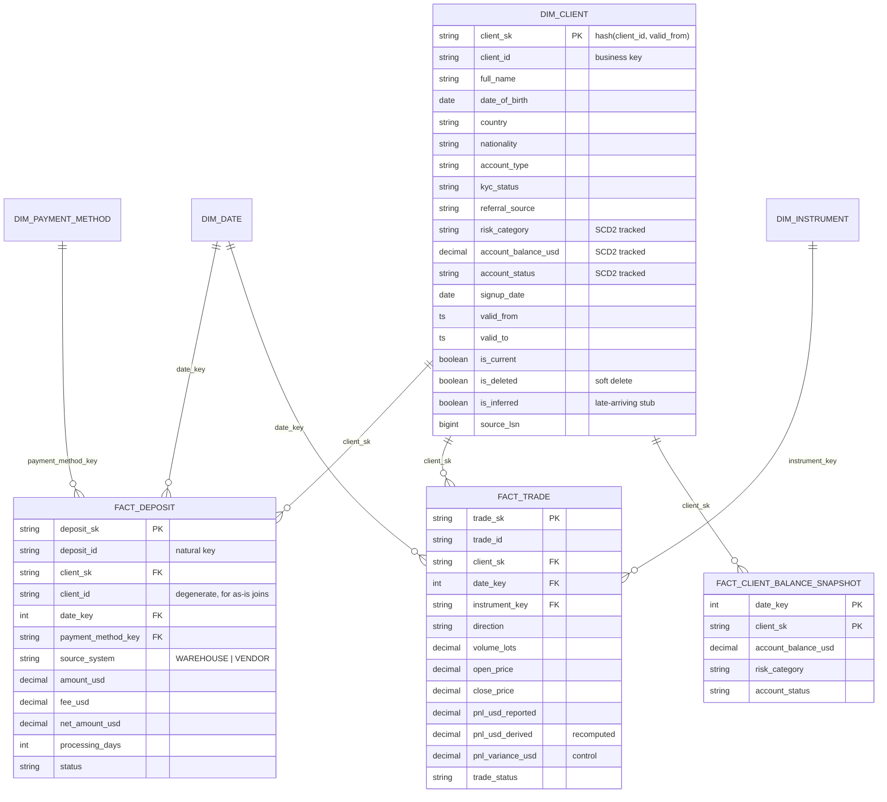

# Part 2 — Data Model & Historization

SQL for everything below is in `sql/`. The model is implemented in
`code/databricks/05_gold_dimensional.py` and exercised by the prototype.

---

## 2a. Dimensional model

### Choice: Kimball star schema, with one Data Vault borrowing

**Kimball**, for reasons specific to this dataset rather than by default:

1. **The business questions are additive and well-bounded.** Deposit volume by country,
   PnL by instrument, funnel by referral source. These are `SUM(measure) BY dimension` —
   exactly what a star is optimised for.
2. **The source topology is already a star.** `client_signup` is the root entity;
   `client_deposit` and `client_trades` are many:1 against it; `client_profile` is 1:1.
   That maps to one conformed client dimension and two facts with almost no reshaping.
3. **Data Vault would be over-engineering here.** Its payoff is many source systems with
   competing definitions of the same entity and high schema churn. We have two sources
   (warehouse + one vendor) and one business key, `client_id`. Vault would add hub/link/
   satellite hops and a mandatory presentation layer on top — roughly triple the objects
   for no analytical gain, and slower C-suite queries.
4. **Delta Lake covers Vault's auditability advantage.** Time travel, `DESCRIBE HISTORY`,
   and the append-only Bronze layer already give full lineage and replay.

**The borrowing:** deposits arrive from two systems that do not share an identifier
namespace (Part 1b). So `fact_deposit` carries an explicit **`source_system`** column and
a surrogate key derived from `source_system + natural_id`. That is Vault-style
multi-source tracking on a Kimball grain — it prevents a future third processor from
colliding with `DEP*` or `VDEP*` IDs.

**When I would revisit this:** if a second and third payment processor onboard, each with
its own client identifier requiring a mastering step, the same-as-link concept starts
earning its cost. One vendor does not justify it.

### ERD



### Tables and grain

| Table | Type | Grain — stated explicitly | Notes |
|---|---|---|---|
| `dim_client` | SCD2 dimension | **One row per client per version of its tracked attributes** | Merges `client_signup` (1:1) and `client_profile` (1:1). Keeping them separate would force every query into a two-dimension join for no benefit. |
| `dim_date` | Conformed | One row per calendar date | Shared by both facts. |
| `dim_instrument` | SCD1 | One row per instrument | Carries `asset_class` (FX / metals / crypto / index) and `contract_size` — the latter is what makes the `TRD012` PnL check possible. |
| `dim_payment_method` | SCD1 | One row per payment method | Low cardinality; history not valuable. |
| `fact_deposit` | Transaction fact | **One row per deposit event per source system** | Additive: `amount_usd`, `fee_usd`, `net_amount_usd`. |
| `fact_trade` | Transaction fact | **One row per trade** | Additive: `pnl_usd`. Semi-additive: `volume_lots`. Non-additive: prices — never `SUM` them. |
| `fact_client_balance_snapshot` | Periodic snapshot | **One row per client per day** | Why it exists below. |

### Why `account_balance_usd` lives in two places

It is an SCD2 attribute on `dim_client` *and* a measure on a daily snapshot fact. That is
deliberate, not redundancy:

- The SCD2 column answers *"what was this client's balance at 14:00 on 15 Nov?"* — exact,
  event-driven, irregular.
- The snapshot fact answers *"what was total AUM by country each day?"* — a question that
  is painful against SCD2 (you must range-join every client's version interval against a
  date spine) and trivial against a daily grain.

The snapshot is derived *from* the SCD2 dimension, so there is one source of truth and no
drift.

### One modelling trap in this data

`account_balance_usd` is named USD, but 13 of 30 clients carry a non-USD `currency`
(`CL003` THB, `CL004` IDR, `CL009` EUR, `CL020` EUR, `CL010` BRL, …). Either the column is
misnamed or the values are unconverted. Summing it across clients today produces a
meaningless number that looks plausible.

The model forces the ambiguity into the open: `account_balance_original`,
`currency`, `fx_rate_to_usd`, and a derived `account_balance_usd` that is *computed*, not
trusted. Until the source confirms the semantics, the derived column is the only one
exposed to reporting.

### Late-arriving dimension records

A deposit or trade for a client whose dimension row has not loaded yet. Present in this
data: `DEP020` → `CL031` and `VDEP020` → `CL099`, neither of which exists in
`client_signup.json`.

Three common responses, two of which are wrong:

- Drop the fact → understates deposits. Unacceptable for financial data.
- Null the FK → breaks the star and silently excludes rows from every dimensional query.
- **Inferred member** → correct.

**The approach:** on encountering an unknown `client_id`, the pipeline inserts a stub
dimension row with `is_inferred = TRUE`, `full_name = 'UNKNOWN'`, `risk_category = 'unknown'`,
and `valid_from = '1900-01-01'` so it covers any historical fact date. The fact loads
immediately with a valid `client_sk`; totals stay complete.

When the real dimension record arrives, the stub is **upgraded in place** — the merge in
`05_gold_dimensional.py` reads `dim_client_current` and updates the same `client_sk` with
real attributes, clearing `is_inferred`. Because the surrogate key never changes, **facts
already loaded do not need restating**. That is the whole point of using a surrogate key
rather than the natural key on the fact.

**What actually happens on this data — and why the count is zero.** Both orphans are
stopped one layer earlier, at the Silver DQ gate (Part 1a.5, EC-4): `VDEP020` and `DEP020`
are quarantined on `client_exists` and never reach Gold, so the current build creates
**0 inferred members**. That is the designed order of precedence, not a dormant feature:
quarantine is preferable while the client might still arrive, because it keeps a known-bad
row out of the star entirely and releases it automatically once the dimension catches up.
The inferred member exists for the orphan that gets past that gate — a client released
mid-run, a dimension row retracted after the fact loaded, or a feed where the orphan is
merely late rather than wrong. Dropping the fact or nulling the FK would still be wrong in
those cases, which is why the mechanism is built rather than deferred.

Inferred members are monitored: an inferred row older than 7 days means the dimension feed
is genuinely broken, not merely late, and alerts. The same ageing rule covers unresolved
quarantine rows. Without both, either mechanism quietly hides a broken upstream.

The invariant that matters is asserted after every Gold build: `fact_deposit` must carry
**zero null `client_sk`**. It does.

One temporal nuance this surfaces: `TRD005` is a trade by `CL007` on **2024-02-20**, but
`CL007`'s `signup_date` is **2024-03-15** — activity 24 days before the client existed.
The fact loads and joins to `CL007`'s earliest dimension version (whose `valid_from` is
open-ended precisely for this reason), and a WARN flags the temporal inconsistency for the
source team rather than silently dropping a real trade.

---

## 2b. Historization (SCD)

### 2b.1 Which SCD type, and why

**SCD Type 2 on `risk_category` and `account_status`. SCD Type 4 (history table + daily
snapshot) on `account_balance_usd`.**

A blanket "Type 2 on all three" is the obvious answer and it is subtly wrong here.

**Why Type 2 for `risk_category` and `account_status`:**

These are low-velocity, high-consequence attributes. `risk_category` drives margin limits
and regulatory treatment; `account_status` drives whether a client can trade. When a
regulator asks *"was this client classified high-risk when that trade was placed?"*, only
Type 2 can answer. Type 1 would overwrite the answer and destroy the evidence.
Change frequency in this feed is low — `CL014`, `CL009`, `CL025` each change
`risk_category` once — so version growth is manageable.

**Why not Type 2 for `account_balance_usd`:**

Balance changes on **every deposit, withdrawal and closed trade**. Putting it in the same
SCD2 row as `risk_category` means a new dimension version per balance movement. With 30
clients that is invisible; with 500,000 active clients trading daily it produces tens of
millions of dimension versions per year, and the dimension stops being slowly changing.
Worse, it pollutes the risk history: querying "when did risk change" returns hundreds of
rows where only the balance moved.

This dataset already shows the pattern. Of `CL001`'s three changes, `lsn 1005` is a pure
balance move ($1,250 → $1,850) with `risk_category` and `account_status` unchanged. It
creates a dimension version that carries no risk information at all.

So balance is versioned separately (Type 4) and aggregated from
`fact_client_balance_snapshot`, keeping `dim_client` genuinely slowly-changing.

**Pragmatic note on the implementation.** The prototype currently tracks all three in the
SCD2 hash, because at 30 clients the split is not yet worth the extra object — and I would
rather ship the simple version and show the migration path than build for a scale that
does not exist. The hash column `record_hash` is the single place that decides what
constitutes a new version, so the split is a one-line change plus a backfill.

**Trade-offs:**

| Option | For | Against | Verdict |
|---|---|---|---|
| **Type 1** (overwrite) | Simplest, smallest, fastest | Destroys history; cannot answer point-in-time; unacceptable for a regulated risk attribute | Used only for `dim_instrument`, `dim_payment_method` |
| **Type 2** (versioned rows) | Full point-in-time truth; the regulatory answer | Table growth; every query needs `is_current` or a date predicate; a forgotten filter silently fans out joins | **Chosen** for `risk_category`, `account_status` |
| **Type 3** (previous-value column) | Cheap "what changed last" | Only one step of history — `CL001` has three changes and Type 3 would lose one | Rejected |
| **Type 4** (history table / snapshot) | Keeps the volatile measure out of the dimension | Extra object; consumers must know where to look | **Chosen** for `account_balance_usd` |
| **Type 6** (hybrid 1+2+3) | Current and historical in one row | Update amplification: every change rewrites all versions of that key | Rejected — write cost on a high-churn attribute |

### 2b.2 Update and delete handling

Full SQL: `sql/04_scd2_dim_client_merge.sql`.

**Step 0 — order the batch.** This is the step that makes the rest correct.

```sql
WITH ordered AS (
  SELECT *, ROW_NUMBER() OVER (PARTITION BY client_id ORDER BY lsn) AS rn,
            LEAD(commit_ts) OVER (PARTITION BY client_id ORDER BY lsn) AS next_commit_ts
  FROM bronze_client_profile_changes
  WHERE lsn > (SELECT COALESCE(MAX(lsn), 0) FROM cdc_apply_log)   -- replay guard
)
```

Sorting by `lsn`, never by `commit_ts` or arrival order. `CL001`'s `1004`/`1005`/`1006`
share a commit date and arrive out of order; only `lsn` gives a total order.

**Step 1 — update.** Two-phase, because a single `MERGE` cannot both close the old row and
insert the new one for the same key.

*Phase A — close the current version:*

```sql
MERGE INTO dim_client t
USING ordered s
  ON t.client_id = s.client_id AND t.is_current = TRUE
WHEN MATCHED AND s.op IN ('update','delete')
     AND t.record_hash <> s.new_record_hash          -- no-op if nothing changed
  THEN UPDATE SET t.valid_to = s.commit_ts, t.is_current = FALSE, t.updated_at = current_timestamp();
```

*Phase B — insert the new version*, carrying forward attributes absent from the partial
`after` image:

```sql
INSERT INTO dim_client
SELECT sha2(concat(s.client_id, s.commit_ts), 256) AS client_sk,
       s.client_id,
       COALESCE(s.after.full_name,     p.full_name)     AS full_name,
       COALESCE(s.after.risk_category, p.risk_category) AS risk_category,
       ...
       s.commit_ts AS valid_from, TIMESTAMP'9999-12-31' AS valid_to,
       TRUE AS is_current, FALSE AS is_deleted, s.lsn AS source_lsn
FROM ordered s LEFT JOIN dim_client p
  ON p.client_id = s.client_id AND p.valid_to = s.commit_ts;
```

The `COALESCE` is essential: `after` carries only the three changed fields, so a naive
insert would null `full_name`, `nationality` and `preferred_language` on every update.

The `record_hash` comparison makes a no-change event a genuine no-op — which is what makes
`lsn 1001` (re-inserting `CL030` with identical attributes) correctly produce **no new
version**.

**Step 2 — delete.** Phase A above already end-dates the current row. Then a tombstone:

```sql
INSERT INTO dim_client
SELECT sha2(concat(s.client_id, s.commit_ts), 256), s.client_id,
       p.full_name, p.date_of_birth, ... ,          -- last known values retained
       s.commit_ts AS valid_from, TIMESTAMP'9999-12-31' AS valid_to,
       TRUE AS is_current, TRUE AS is_deleted,      -- <-- tombstone
       s.lsn AS source_lsn, 'delete' AS source_op
FROM ordered s JOIN dim_client p ON p.client_id = s.client_id AND p.valid_to = s.commit_ts
WHERE s.op = 'delete';
```

**What happens in the warehouse when a delete arrives** (`lsn 1010`, `CL012`):

| | |
|---|---|
| Physical rows deleted | **Zero** |
| Prior version | `valid_to` closed at `2024-11-21 14:00:00`, `is_current = FALSE` |
| New version | Tombstone with `is_deleted = TRUE`, last known attributes retained |
| `fact_deposit` rows for `CL012` (`DEP008`, `VDEP004`) | Still join successfully |
| Current-state reports | Exclude `CL012` via `WHERE is_deleted = FALSE` |
| Point-in-time report for October 2024 | Still shows `CL012` as active — correct, because it was |
| Audit trail | `cdc_apply_log` row: `lsn 1010`, `action_taken = 'soft_delete_tombstone'` |

**Step 3 — record the watermark.** Every applied `lsn` is written to `cdc_apply_log` in the
same transaction as the dimension write. Delta's ACID guarantee means the watermark cannot
advance without the data landing, and vice versa. Without that atomicity, a failure between
the two produces either silently skipped events or infinitely reapplied ones.

**On LSN gaps.** This feed has gaps: `1002, 1007, 1011, 1013, 1014, 1016, 1017, 1019`.
These are *expected* — a database transaction log is shared across all tables, so gaps are
transactions against other tables. Alerting on every gap would produce constant false
pages. We track the high-water mark and alert only if a gap remains unfilled past the
completeness SLA, which distinguishes "this LSN was for another table" from "we lost data".

**Why not `AUTO CDC` / `APPLY CHANGES INTO`?** Databricks' AUTO CDC API (which replaced
`APPLY CHANGES`, and is the current recommendation) would implement this declaratively —
`STORED AS SCD TYPE 2` with `SEQUENCE BY lsn` handles reordering and end-dating natively,
and is what I would reach for in production on a Lakeflow Pro/Advanced pipeline. I wrote
the explicit `MERGE` here because it requires those pipeline editions, it obscures the
reordering logic this assessment is asking me to demonstrate, and the partial-after-image
`COALESCE` needs care either way. `sql/04_scd2_dim_client_merge.sql` includes the AUTO CDC
equivalent as a commented alternative.

### 2b.3 Reloading a historical date range without corrupting history

Re-processing November 2024. The requirement is that history must survive — so a naive
`DELETE WHERE month = 11` is disqualified immediately: it destroys SCD2 versions whose
`valid_from` is in November but which are still the *current* version, orphaning every
later fact.

**The procedure:**

**1. Bound the blast radius precisely.** The set to restate is not "rows whose `valid_from`
is in November". It is every dimension version whose *validity interval overlaps* November:

```sql
WHERE valid_from < '2024-12-01' AND valid_to >= '2024-11-01'
```

A version opened in September and still open in November is affected by a November
restatement. The naive predicate misses it.

**2. Snapshot before touching anything.** Record the current Delta version so the whole
operation is reversible:

```sql
DESCRIBE HISTORY dim_client;          -- note version N
-- rollback if needed:
RESTORE TABLE dim_client TO VERSION AS OF N;
```

This is the real safety net. Delta time travel means a botched backfill is a one-statement
recovery rather than an incident.

**3. Rewind the CDC watermark, do not delete rows.**

```sql
DELETE FROM cdc_apply_log WHERE commit_ts >= '2024-11-01' AND commit_ts < '2024-12-01';
```

The watermark is control data, not history. Removing these entries makes the pipeline
eligible to reprocess exactly that window.

**4. Surgically unwind the affected dimension versions.** Delete only versions *created by*
the LSNs being replayed, then reopen the version that preceded them:

```sql
DELETE FROM dim_client
WHERE source_lsn IN (SELECT lsn FROM bronze_client_profile_changes
                     WHERE commit_ts >= '2024-11-01' AND commit_ts < '2024-12-01');

MERGE INTO dim_client t
USING (SELECT client_id, MAX(valid_from) AS vf FROM dim_client GROUP BY client_id) s
  ON t.client_id = s.client_id AND t.valid_from = s.vf
WHEN MATCHED THEN UPDATE SET t.valid_to = TIMESTAMP'9999-12-31', t.is_current = TRUE;
```

Versions created *outside* November are never touched. October's history is untouched by
construction, not by hope.

**5. Replay.** Re-run the standard CDC merge. Because it is ordered by `lsn` and guarded by
`cdc_apply_log`, it rebuilds exactly the same November timeline — deterministically. Same
inputs, same LSN order, same output.

**6. Restate the facts by partition, not by delete-insert.**

```python
(df.write.format("delta").mode("overwrite")
   .option("replaceWhere", "date_key >= 20241101 AND date_key <= 20241130")
   .saveAsTable("gold.fact_deposit"))
```

`replaceWhere` is atomic: readers see either the old November or the new November, never a
half-loaded month. A `DELETE` + `INSERT` pair exposes an empty window to anyone querying
mid-run — which, for a C-suite report, means a zero where there should be revenue.

**7. Verify before releasing.** Compare control totals against the pre-backfill snapshot
and assert the SCD2 invariants below. Only then publish.

**Invariants asserted after every backfill** (`sql/08_backfill_restatement.sql`):

```sql
-- exactly one current version per non-deleted client
SELECT client_id, COUNT(*) FROM dim_client WHERE is_current GROUP BY 1 HAVING COUNT(*) > 1;
-- no gaps or overlaps in any client's timeline
SELECT client_id FROM (
  SELECT client_id, valid_to, LEAD(valid_from) OVER (PARTITION BY client_id ORDER BY valid_from) nxt
  FROM dim_client) WHERE nxt IS NOT NULL AND nxt <> valid_to;
-- no version opens after it closes
SELECT * FROM dim_client WHERE valid_from >= valid_to;
```

All three return zero rows on the current build.

**Why this is safe overall:** the backfill is re-derivation, not mutation. Bronze is
append-only and still holds every original CDC event, so November's history is rebuilt
from the same immutable source that produced it the first time. Nothing is edited in
place; the only destructive step is scoped to versions the replay will itself recreate,
and Delta `RESTORE` covers even that.
