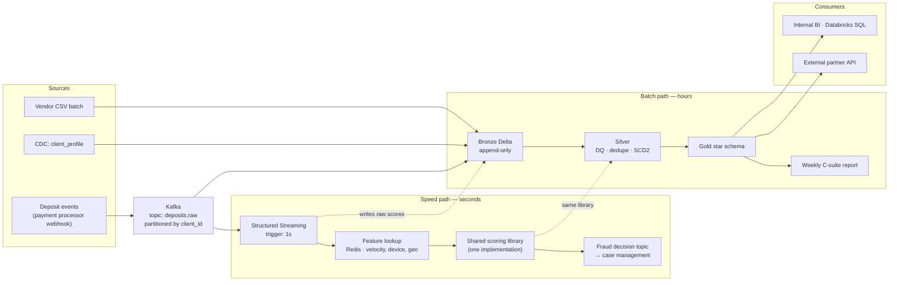

# Part 3 — TL Extension

---

## 3a. Unified real-time and batch architecture

**Requirement:** a fraud signal within *seconds* of each deposit event, while the existing
batch pipeline continues to serve the weekly C-suite report, with both internal systems and
an external partner API consuming the data.

### Tooling choice

| Concern | Choice | Reasoning |
|---|---|---|
| Event transport | **Kafka** (MSK / Confluent) | Deposit events published once, consumed independently by the fraud path and the analytics path. Replayable log — the same events can be re-read to rebuild state after a bad model deploy. |
| Real-time compute | **Spark Structured Streaming** on Databricks, continuous/1-second trigger | Same engine, language and Unity Catalog governance as the batch path. One skillset, not two. |
| Fraud feature state | **Redis** (or Delta + Change Data Feed for non-critical features) | Sub-10ms lookups for velocity features. Delta is not a serving store — this is the one place I would not use it. |
| Storage / serving | **Delta Lake on Unity Catalog** | ACID, time travel, and concurrent read/write on the same table from both paths. |
| Orchestration | **Lakeflow Jobs** | Batch DAG; streaming jobs run continuously alongside. |
| External API | **Delta Sharing** for bulk, **REST gateway over Gold views** for row-level | Covered below. |

**Why not Kappa (stream-only)?** It is intellectually cleaner and wrong for this case. The
weekly C-suite report needs full-history recomputation after late corrections — exactly the
restatement scenario in Part 2b.3. Replaying 18 months of Kafka to restate one month is far
more expensive and more fragile than a partition overwrite. Batch is not legacy here; it is
the right tool for a different job.

**Why not classic Lambda with two codebases?** The well-known failure is logic drift: the
streaming fraud rule and the batch fraud metric diverge, and nobody notices until they
disagree in front of the regulator. The design below keeps the *paths* separate but the
*business logic* shared.

### Architecture

### How the two paths coexist without blocking each other

Four separations:

1. **Separate compute, shared storage.** The streaming job runs on its own cluster with
   reserved capacity. The batch job cannot starve it, and a batch backfill spinning up 40
   nodes has no effect on fraud latency. They meet only at Delta tables, where MVCC lets
   the streaming writer append while the batch reader scans a consistent snapshot — no
   locks, no blocking.

2. **The speed path never reads Gold.** It depends only on Kafka and Redis. This is the
   critical isolation: a failed or slow batch run cannot degrade fraud detection. Fraud
   keeps working through a complete analytics outage.

3. **Write isolation.** Streaming writes to its own Bronze table
   (`bronze_deposit_events_rt`) with its own checkpoint. Batch reads it as a stream source.
   Neither writes to the other's table, so there are no concurrent-write conflicts on the
   same partitions.

4. **Shared logic, not shared execution.** Scoring rules live in one versioned Python
   library imported by both paths. The streaming path applies it per event; the batch path
   applies it over history for model retraining and back-testing. Drift becomes a code
   review question rather than a production discovery.

### Latency vs consistency — where eventual consistency is acceptable

Explicit, per consumer:

| Consumer | Latency target | Consistency model | Rationale |
|---|---|---|---|
| **Fraud decision** | < 2s p99 | **Eventual, best-effort** | Accepted deliberately: a fraud score computed on features that are 30s stale is enormously better than a perfect score 6 hours late. The cost of a false negative is a completed fraudulent withdrawal. |
| **Fraud case management** | < 1 min | Read-your-writes | An investigator must see the alert that was just raised. |
| **Internal BI** | Hourly | Strong within a batch | Analysts tolerate staleness; they do not tolerate a number that changes between two refreshes. |
| **C-suite weekly report** | Weekly | **Strong, immutable** | Must be reproducible and identical on re-query. Served from a *tagged* Delta version, not the live table — so a Tuesday backfill cannot silently change the number quoted in Monday's board meeting. |
| **External partner API** | Minutes | Strong, versioned | Below. |

**Where I explicitly refuse eventual consistency:** anything financial that is reported
externally or to the board. Deposit totals, PnL, client counts. The speed path is
allowed to be approximate because its output is a *signal*; the batch path is the
**system of record** and must be exact. Every fraud score is also recomputed in batch, and
a divergence between real-time and batch scores beyond tolerance is itself monitored — that
reconciliation is how you catch a silently broken streaming job.

**The honest trade-off:** the real-time path will occasionally score a deposit on stale or
missing features — a client's very first deposit has no velocity history. That is accepted,
with a conservative default for cold-start clients and a batch sweep that re-scores within
the hour. The alternative, blocking the decision until features are complete, converts a
latency problem into an availability problem at the payment gateway.

### Consistent, secure view for the external partner API

Six controls:

1. **Contract surface, not tables.** Partners read versioned Gold *views*
   (`gold.partner_v1.deposit_summary`), never base tables. Internal refactors do not break
   partners; `v1` and `v2` run side by side during migration with an announced sunset.

2. **Snapshot isolation.** Each API response is served from a pinned Delta version, so
   pagination cannot straddle a mid-run write and return the same row twice or skip one.
   The version is returned in the response header for full reproducibility.

3. **Row and column security.** Unity Catalog row filters and column masks restrict each
   partner to its own clients; PII (`full_name`, `date_of_birth`, `email`) is masked or
   tokenised. Enforced at the catalog, not in application code — so a new query path cannot
   accidentally bypass it.

4. **Deletes are visible.** Because deletes are soft (Part 1a.4), the partner view exposes
   `is_deleted` rather than rows silently vanishing. A partner reconciling counts can see
   *why* a record disappeared.

5. **Bulk vs row-level.** Delta Sharing for bulk extracts — no data copy, governed, with
   full audit. A thin REST gateway for row-level lookups, with per-partner rate limits and
   OAuth2 / mTLS.

6. **Published SLA and audit.** Freshness guarantee, a `data_as_of` timestamp on every
   response, and a status endpoint. Unity Catalog audit logs record every partner access.
   A partner who cannot tell whether data is 5 minutes or 5 hours stale will eventually
   make a decision on the assumption that suits them.

---

## 3b. Build vs buy — onboarding a new payment processor

### Decision criteria

I weight these in roughly this order:

1. **Total cost of ownership over 3 years**, not licence price. Build cost must include
   maintenance, on-call, and the connector breaking at 2am when the vendor changes a
   field — which is exactly what happened in this assessment's own data
   (`payment_method` → `method` on day 2).
2. **Strategic differentiation.** Does this connector create competitive advantage? Payment
   ingestion is plumbing. Fraud models are differentiation. Build where you differentiate;
   buy the plumbing.
3. **Source stability and connector maturity.** A well-supported off-the-shelf connector to
   Stripe is more reliable than anything my team writes in a sprint. A bespoke SFTP drop
   with a hand-rolled CSV dialect has no off-the-shelf connector worth buying.
4. **Data sensitivity and residency.** Financial PII through a third-party processor means
   another sub-processor in the GDPR/PDPA chain, another vendor security review, and
   possibly a residency conflict.
5. **Time to value.** What is the cost of the data being 6 weeks late?
6. **Team capacity — honestly assessed.** Not "can we build it" (we can) but "can we
   maintain it for three years alongside everything else".
7. **Exit cost.** How hard is it to leave if pricing changes or the vendor is acquired?

### When each wins

**Buy wins when:**
- A mature connector already exists for the source (Stripe, Adyen, Salesforce, Postgres CDC).
- The schema is stable and the vendor maintains the connector through their own API changes.
- Volume is low-to-moderate, so consumption pricing stays predictable.
- The team is capacity-constrained and the work is undifferentiated.
- Time to value matters more than unit cost — the classic case being a compliance deadline.

**Build wins when:**
- The source is bespoke: proprietary formats, unusual auth, an SFTP drop with vendor-specific
  quirks. No platform has a connector, so "buy" means buying a generic file connector and
  writing all the logic anyway — paying twice.
- Ingestion requires non-trivial in-flight logic: the reconciliation and two-tier matching in
  Part 1b is not something a generic connector does.
- Volume is high enough that per-row pricing exceeds engineering cost. At tens of millions of
  monthly rows, MAR-based pricing typically crosses a built connector's amortised cost.
- Data residency or contractual terms forbid a third-party processor touching the data.
- Latency requirements are below what the platform's minimum sync interval supports.

### Recommendation for this specific case

**Buy — use a managed connector for raw landing, build the transformation layer.**

Specifically: use the integration platform only to move bytes from the processor into
Bronze, and keep all normalisation, DQ, reconciliation and SCD2 logic in our own Databricks
code.

Reasoning grounded in what this assessment's data actually shows:

- The vendor delivers **CSV files on a daily cadence** — the most commoditised ingestion
  pattern there is. There is no advantage in writing our own file poller, retry logic and
  schema registry.
- The genuinely hard parts are *not* ingestion. They are the backdated `20240303` file, the
  `method` rename, the duplicate `VDEP002`/`VDEP005`, the `CL099` orphan, and the finding
  that vendor and warehouse IDs share no namespace. **No integration platform solves any of
  those.** A connector would land all 24 rows faithfully and leave every one of those
  problems on our side of the line.
- Onboarding a payment processor is a recurring event, not a one-off. The second and third
  processors cost near-zero on a platform and a full sprint each if hand-built.
- We already have Auto Loader doing this competently for the current feed
  (`02_bronze_streaming_autoloader.py`), which means the incremental case for a paid
  platform is weaker than it would be from a standing start — a point worth making to
  whoever is approving the spend.

This split avoids the trap at both extremes: building undifferentiated plumbing, or pushing
business logic into a vendor tool where it becomes unversioned, untestable, and invisible
in code review.

### What would change my mind

| Signal | Decision change |
|---|---|
| Volume grows past ~10M rows/month and MAR pricing exceeds ~2 engineer-weeks/year amortised | Build the connector |
| The processor exposes a bespoke API with no supported connector | Build — "buy" would be a generic HTTP connector plus all the logic anyway |
| Legal blocks a third-party sub-processor handling financial PII, or residency conflicts | Build, no further debate |
| The fraud use case requires sub-minute deposit latency | Build — most platforms' minimum sync interval is ~5–15 minutes, which fails the Part 3a requirement outright |
| The processor already has a first-class, vendor-maintained connector | Buy more of the stack, not less |
| Two engineers leave and capacity halves | Buy — the maintenance argument becomes decisive |

The signal I would watch first is **connector break frequency**. If the managed connector
needs manual intervention more than once a quarter, we are paying for a platform and doing
the work anyway, and the economics have already inverted.
